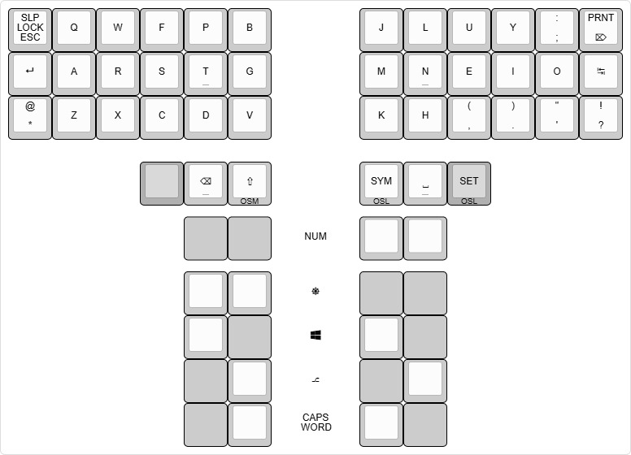

# ThrownException Keyboard
This repository documents all the details of my every-day keyboard and keymap.
> I use both Bertie2011 and ThrownException as online nicknames

The list of sections below will start with the keymap and QMK libraries, followed by each of the keyboards I have built (newest first).

**Click on any of the images below for more information!**

## Keymap
Many keymaps make use of holding keys to distinguish from their tap behavior. However, holding keys really sucks! For me it feels like tapping two keys is less effort than holding a key. So the philosophy behind the keymap is to be **strictly tap only**. If you're curious about how that's possible and which tricks were pulled to make it easier to use click the image below.

## QMK Libraries
As a programmer, I love customizing QMK to the point where my keymap.c was feeling a bit too cramped to fit all the custom code. I have isolated my keymap features into seperate source files (aka "mini QMK libraries", aka "bags of tricks") so that others can use them too.

[View QMK Libraries](/qmk-lib/README.md)

## Aurora Corne V1.1 - splitkb.com
With frequent moving of the keyboard between home and work, the rotary encoders were the first to break. I also didn't get much use out of the trackpad, since it requires lifting your hand and at that point you might as well reach for the mouse. A break in the audio jack connections was the final straw. It was time for a new keyboard and I have been wanting a 6th column for a while, so coming from a trusted vendor, the choice for the Aurora Corne was made.

## Dilemma V2 - Bastard Keyboards
Since getting my first split keyboard I never stopped trying to optimize my keymap to the point that the most noticeable discomfort was having to switch over to the mouse every now and then. I tried mouse keys, but could never get used to them so I started looking at the keyboards offered on bastardkb.com. The OLED displays were only used for layer/mod indicators, which I thought would be easier to spot if the keys themselves lit up as indicators with RGB. Throw in rotary encoders which I didn't have before and the decision was made.

## Kyria rev2.0 - splitkb.com
As a programmer I need to be able to type comfortably for many years. To avoid RSI related problems in the future, I wanted to stay ahead and get a more ergonomic keyboard. It was perfect timing, because I was transitioning from a laptop to a gaming PC at the same time, so I needed a new keyboard anyways.

