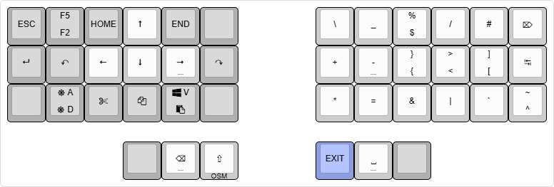
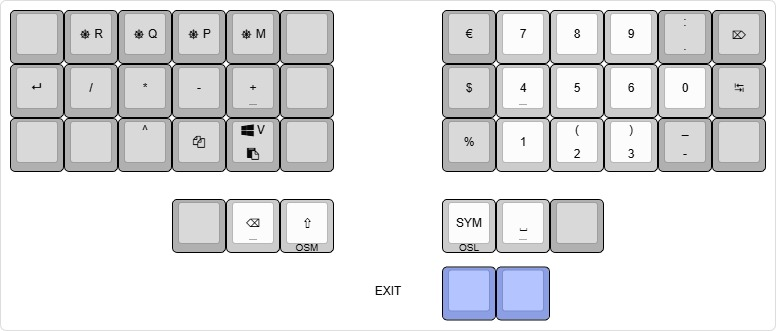
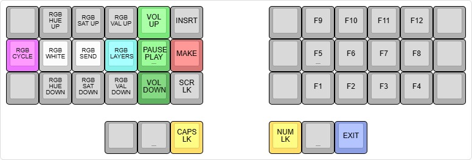
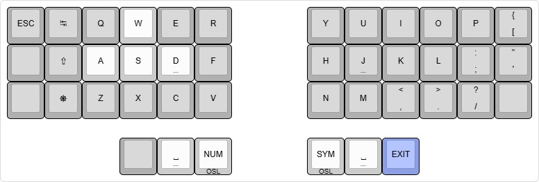

# ThrownException Keymap
When doing a deep dive into small keyboard keymaps, a lot of them seem to rely on holding keys, whether that's for switching layers, using modifiers or simply fitting another special character on the same key. 

This didn't feel right for me, because when I decide I want to put something on the screen, I only want to to think about what to do and not how to do it. I want my input to be instant and not be dependent on any kind of delay. Also the effort of holding a key and pressing another seems to be more than the effort of pressing two or even three keys shortly.

## Philosophy
* Use the Colemak Mod-DH base layout for improved ergonomics
* Avoid holding keys at all costs for instant input and decreased effort
* Avoid thinking about which layers were activated earlier, only think about the next key.
  * All layers can be activated from any other layer, no need to disable a layer first
  * The [symbols layer](#symbols-layer) has a special implementation that allows repetition and base layer access at the same time. 
* Exclusive layers, only 1 extra layer can be active at a time

## QMK Libraries
My keymap contains some custom code. If you want to really understand what's going on or would like to try out some unique features for yourself, check out my [QMK lib folder](/qmk-lib/README.md).

## Base Layer
This layer is based on Colemak Mod-DH. Although I got a little creative with the symbols, my favorite being the parentheses instead of angle brackets above the comma and period. The thumb keys are occupied by backspace, one shot shift, symbols layer and space keys. The thumb keys have several combos for the other modifiers, the numbers layer and caps word functionality. The top left corner has escape, (using SHIFT) screen lock and (using CTRL) sleep keys. The top right corner has delete and (using SHIFT) printscreen keys.

## Symbols Layer
The symbols layer consists of a clear distinction between halves, on the left there is a navigation cluster and the right is filled with symbols. The outer columns and thumb cluster (and its combos) share similarities with the base layer. Custom code is used so that the layer will only automatically deactivate when symbols, F-keys or thumb keys are pressed.

### Navigation Cluster
On the left you can see the arrow keys, surrounded by cut/copy/paste (WIN+V invokes the built-in clipboard history) and home/end (jump to start/end of line) keys. In the surrounding columns you can find the undo (CTRL+Z), redo (CTRL+Y), rename (F2), refresh (F5), select next occurrence (CTRL+D) and select all (CTRL+A) shortcuts. I placed the `/` on this side as well so I could (un)comment code using only one hand.

### Symbols
Some insights on why I picked these positions for the symbols
* I'm a programmer, so access to brackets is important. I put the opening brackets on the home row, because editors often auto complete the closing brackets.
* Logic operators & (`and`) and | (`or`) are next to each other.
* Backtick shares the same key as the other quote types underneath.
* Symmetry with both types of slash characters.
* Least frequently used characters share the same keys, which can be accessed using CTRL/SHIFT.

## Numbers Layer
This layer has a numpad on the right. It shares the parentheses, thumb keys and some of the outer column keys with the base layer. It's worth noting that the period key is specifically the numpad version, which most apps should translate to the appropriate decimal separator (comma or period) depending on the locale. On the left you can find the common arithmetic operators as well as shortcuts for manipulating the memory (based on the Windows calculator app) and copy/paste keys in the same location as the symbols layer.

## Settings Layer
The settings layer only contains F-keys, some locking keys and keys for controlling RGB settings.

## Game Layer
The outer thumb key on the symbol layer will cause the keyboard to switch to this base layer. It's a simple QWERTY base layer with the left hand shifted over to bring WASD under the correct fingers. It also has another column on the left with commonly used modifier keys.

